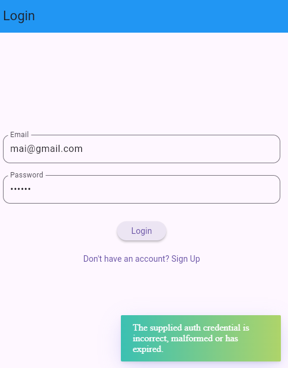
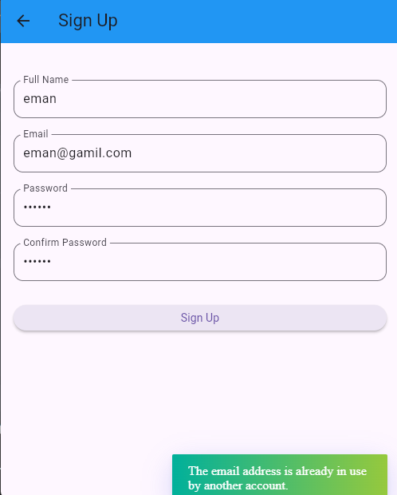
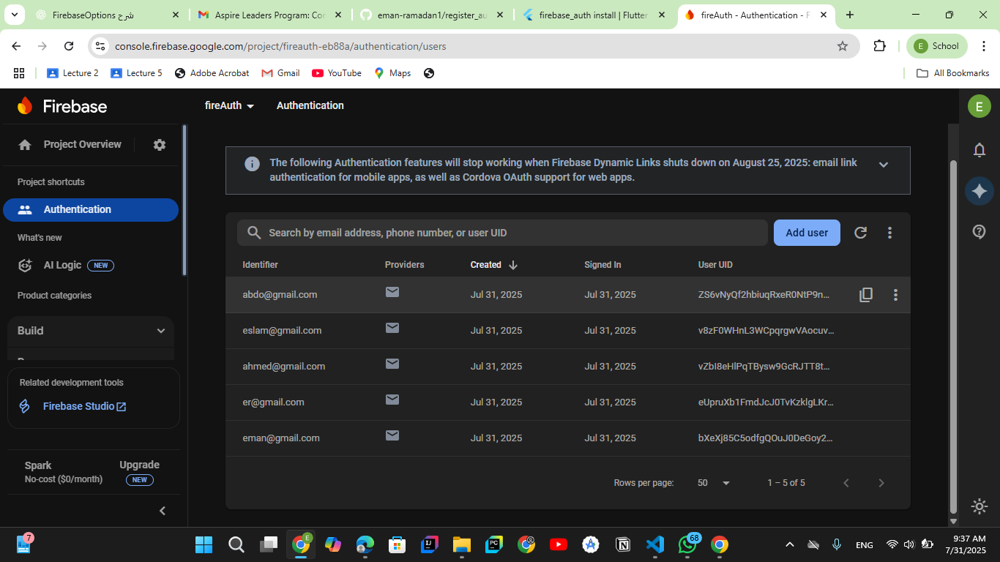

# register_auth

A new Flutter project.

## Getting Started

This project is a starting point for a Flutter application.

A few resources to get you started if this is your first Flutter project:

- [Lab: Write your first Flutter app](https://docs.flutter.dev/get-started/codelab)
- [Cookbook: Useful Flutter samples](https://docs.flutter.dev/cookbook)

For help getting started with Flutter development, view the
[online documentation](https://docs.flutter.dev/), which offers tutorials,
samples, guidance on mobile development, and a full API reference.
# 🚀 Register Auth App

A simple Flutter app for user registration and login using **Firebase Authentication** and **BLoC Pattern**.

## 📱 Screenshots

| Sign Up Screen | Login Screen |
|----------------|--------------|
|  |  |

 |
> **Note:** Make sure the images are stored inside `assets/screenshots/` and added in `pubspec.yaml`.

## 🔧 Features

- Firebase Email/Password SignUp
- Login with Firebase
- BLoC for state management
- Form validation
- Toasts for success & error feedback
- Clean UI & clean code structure

## 🧠 Tech Stack

- Flutter 💙
- Firebase Auth 🔥
- Flutter BLoC ⚙️
- Dart 🐦

## 📦 Installation

1. Clone the repo:

git clone https://github.com/eman-ramadan1/register_auth.git
cd register_auth
